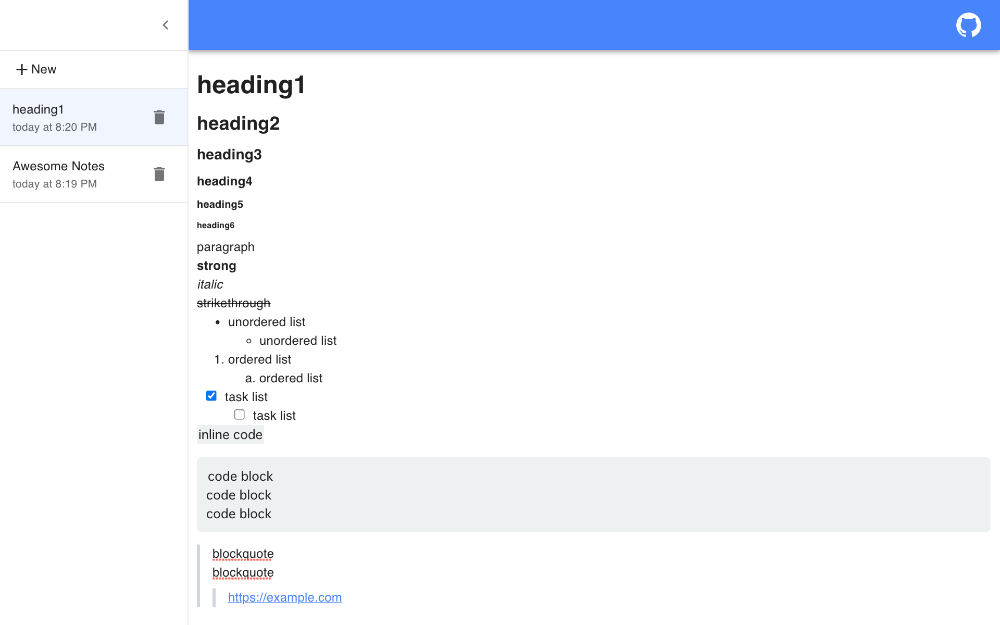

# Awesome Notes

Simple and powerful notes.  

Awesome Notes is a powerful and simple notes with markdown shortcuts.  
You can manage multiple notes, and text saving is automatic.  
The contents of the notes are stored locally, so there is no need to worry about them leaking to the outside.  

Enjoy writing notes comfortably!  

# LICENSE

[MIT](./LICENSE)
